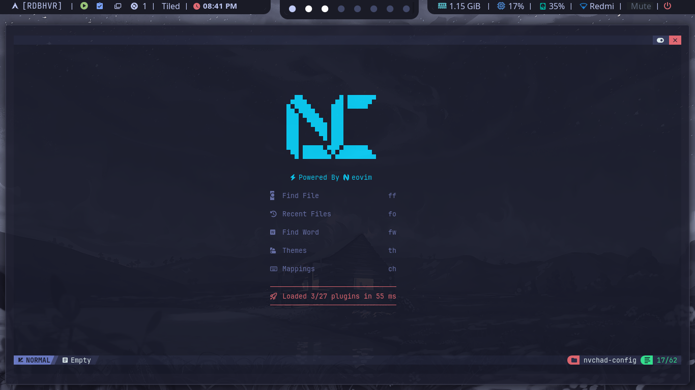
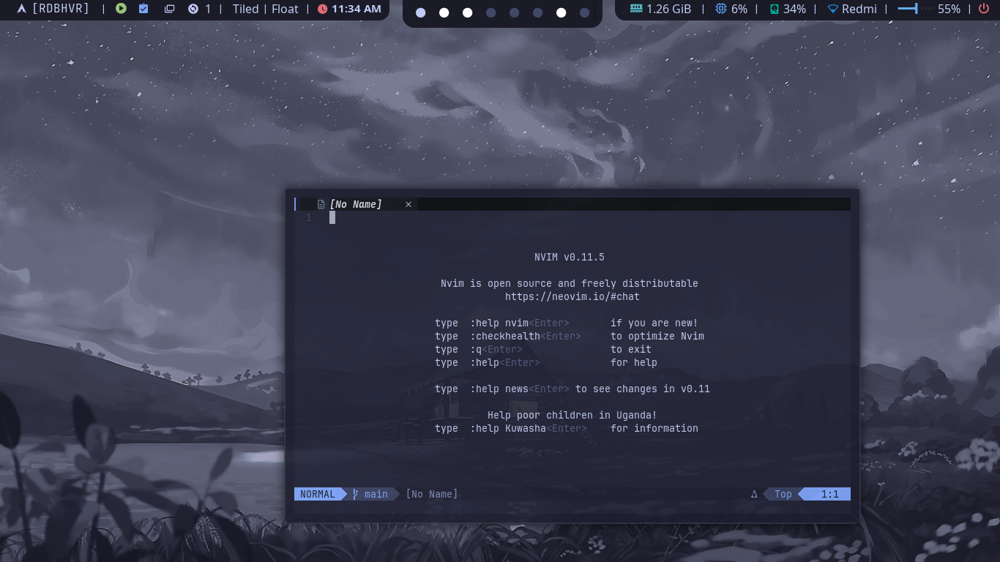
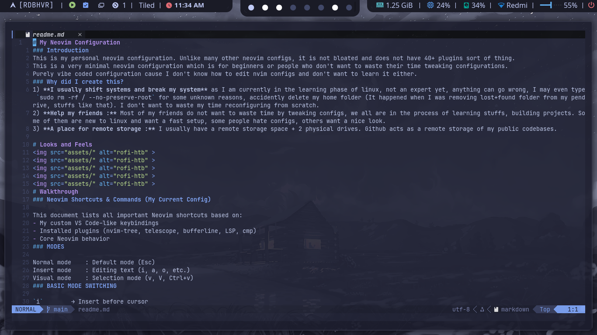
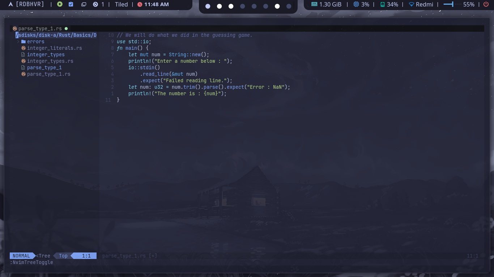
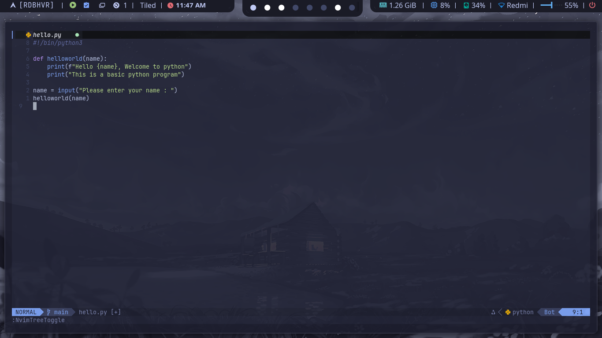
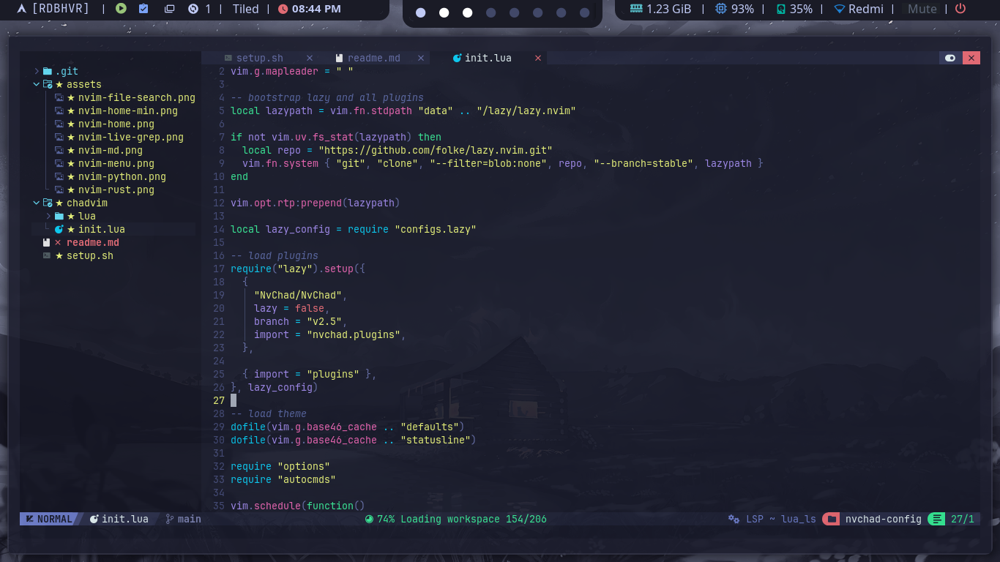
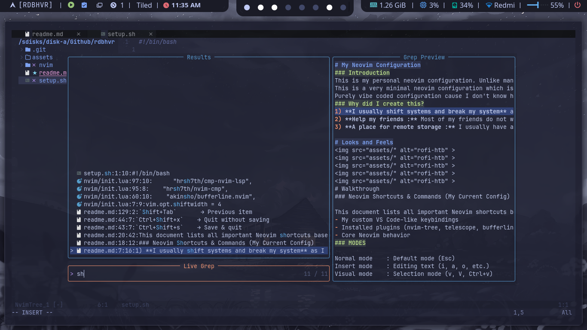
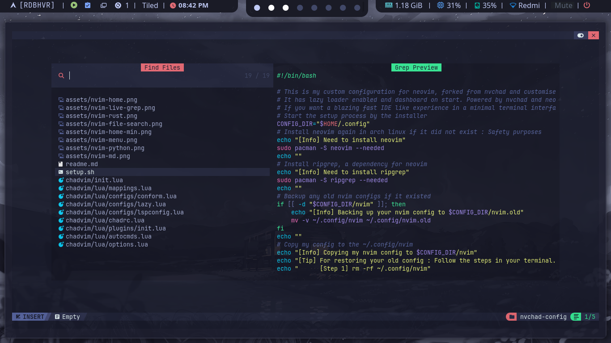

# My Neovim Configuration
### Introduction
This is my personal neovim configuration. Unlike many other neovim configs, it is not bloated and does not have 40+ plugins sort of thing.
This is a very minimal neovim configuration which is for beginners or people who don't want to waste their time tweaking configurations.
Purely vibe coded configuration cause I don't know how to edit nvim configs and don't want to learn it either.
### Why did I create this?
1) **I usually shift systems and break my system** as I am currently in the learning phase of linux, not an expert yet, anything can go wrong, I may even type `sudo rm -rf / --no-preserve-root` for some unknown reasons, accidently delete my home folder (It happened when I was removing lost+found folder from my pendrive, stuffs like that). I don't want to waste my time reconfiguring from scratch.
2) **Help my friends :** Most of my friends do not want to waste time by tweaking configs, we all are in the process of learning stuffs, building projects. Some of them are new to linux and want a fast setup, some people hate configs, others want a nice look.
3) **A place for remote storage :** I usually have a remote storage space + 2 physical drives. Github acts as a remote storage of my public codebases.

# Looks and Feels

### Neovim Home

### Neovim Syntax Highlighting

**Markdown**

**Rust**

**Python**

### Neovim Interface

**Menu**

**Live Grep**

**Find File**

# Walkthrough
### Neovim Shortcuts & Commands (My Current Config)

This document lists all important Neovim shortcuts based on:
- My custom VS Code–like keybindings
- Installed plugins (nvim-tree, telescope, bufferline, LSP, cmp)
- Core Neovim behavior
### MODES

Normal mode    : Default mode (Esc)
Insert mode    : Editing text (i, a, o, etc.)
Visual mode    : Selection mode (v, V, Ctrl+v)
### BASIC MODE SWITCHING

`i`        → Insert before cursor  
`a`        → Insert after cursor  
`o`        → New line below and insert  
`O`        → New line above and insert  
`Esc`      → Back to Normal mode  
`v`        → Visual (character selection)  
`V`        → Visual line selection  
`Ctrl+v`   → Visual block selection  
### FILE OPERATIONS (CUSTOM – INSERT MODE)

`Ctrl+s`          → Save file  
`Ctrl+x`          → Quit  
`Ctrl+Shift+s`    → Save & quit  
`Ctrl+Shift+x`    → Quit without saving  

### FILE OPERATIONS (NORMAL MODE – CORE)

`:w`              → Save  
`:q`              → Quit  
`:wq`             → Save & quit  
`:q!`             → Quit without saving  
`:e filename`     → Open file  
`:bd`             → Close buffer  
### FILE EXPLORER (nvim-tree)

`Ctrl+b`          → Toggle sidebar (file explorer)

**Inside sidebar:**

`Enter`           → Open file / folder  
`o`               → Open file  
`a`               → Create file  
`d`               → Delete file  
`r`               → Rename  
`x`               → Cut  
`c`               → Copy  
`p`               → Paste  
`q`               → Close sidebar  
### FUZZY FINDER (Telescope)

`Ctrl+p`          → Find files  
`Ctrl+f`          → Search text in project (live grep)

**Inside Telescope:**

`Ctrl+n / Ctrl+p` → Move selection  
`Enter`           → Open selection  
`Esc`             → Close Telescope  
### TABS / BUFFERS (bufferline)
**Buffers are tabs (VS Code–style)**

`:bn`             → Next buffer  
`:bp`             → Previous buffer  
`:bd`             → Close current buffer  
### TEXT EDITING (NORMAL MODE)

`x`               → Delete character  
`dd`              → Delete line  
`yy`              → Copy (yank) line  
`p`               → Paste below  
`P`               → Paste above  
`u`               → Undo  
`Ctrl+r`          → Redo  
`>>`              → Indent line right  
`<<`              → Indent line left  
### SELECTION & EDITING (VISUAL MODE)

`v + movement`    → Select text  
`y`               → Copy selection  
`d`               → Delete selection  
`p`               → Paste over selection  

**Indent selection:**

`>`               → Indent right  
`<`               → Indent left  

### SEARCH & NAVIGATION

`/text`           → Search forward  
`?text`           → Search backward  
`n`               → Next match  
`N`               → Previous match  

`gg`              → Go to top of file  
`G`              → Go to bottom  
`:number`         → Go to line number  
### LSP (LANGUAGE SERVER) 

`gd`              → Go to definition  
`gr`              → Find references  
`K`               → Hover documentation  
`F2`              → Rename symbol  
`F12`             → Go to definition  
`<leader>ca`      → Code actions  
### AUTOCOMPLETION (nvim-cmp)

`Tab`             → Next completion item  
`Shift+Tab`       → Previous item  
`Enter`           → Confirm completion  

### INSERT MODE TEXT NAVIGATION (CORE)

`Ctrl+h`          → Move left  
`Ctrl+l`          → Move right  
`Ctrl+w`          → Delete previous word  
`Ctrl+u`          → Delete to line start  
### INDENTATION BEHAVIOR

`Tabs` = spaces (4 spaces)

**Except:**

`Makefile`        → Real tabs (expandtab disabled)
### MOUSE SUPPORT

Mouse enabled:
- Click to move cursor
- Scroll to move
- Resize splits
### THEME
Theme: tokyonight  
True color enabled  
### MENTAL MODEL
Normal mode = command language  
Insert mode = typing  
Visual mode = selection  

Neovim is NOT a text editor.
It is a programmable editor engine.
